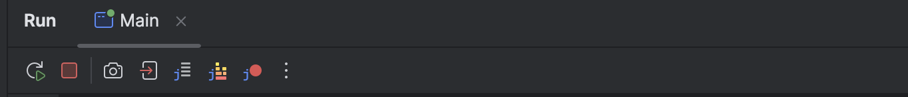
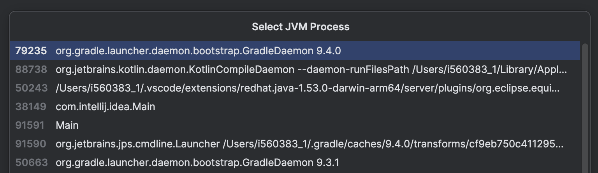
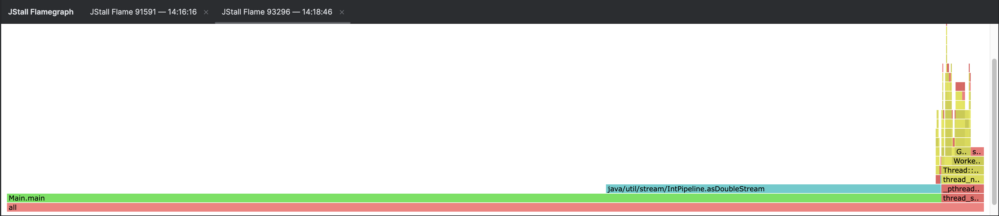

# JStall IntelliJ Plugin


[](https://plugins.jetbrains.com/plugin/30667-jstall)
[](https://plugins.jetbrains.com/plugin/30667-jstall)

<!-- Plugin description -->
A tiny plugin to integrate the [jstall](https://github.com/parttimenerd/jstall) CLI tool into [IntelliJ](https://www.jetbrains.com/idea/),
giving you JVM diagnostics (thread analysis, deadlock detection, flame graphs, …) directly in your IDE,
instead of just basic thread dumps.

JStall is aimed at the moment when a JVM looks suspicious, stuck, or just slower than expected, and you want better diagnostics without switching to external tools.

The plugin supports:

- running JStall commands (`status`, `record`, `flame`) on a running JVM directly from the IDE, with automatic PID detection when invoked from a Run window
- displaying flame graphs in an interactive embedded viewer (not supported on Windows)
- extracting and analyzing JStall recording ZIP files directly in the IDE with a double-click or context menu actions

Simple, yet power powerful.

<!-- Plugin description end -->

## Run Toolbar Actions

Available in the **Run** tool window toolbar (next to Stop, Rerun, …):



- **JStall Status** — Analyze a running JVM with `jstall status` and view the output in a console tab.
  Automatically uses the PID of the process in the current run window.
- **JStall Record** — Record JVM diagnostics over time into a ZIP file (`<project-dir>/<pid>-<timestamp>.zip`)
  for later analysis.
- **JStall Flame** — Generate a CPU [flamegraph](https://www.brendangregg.com/flamegraphs.html) for a running JVM
  and display it in an interactive HTML viewer inside the IDE (not supported on Windows).

All actions fall back to a **JVM selector popup** when invoked outside a run window
(e.g. via <kbd>Shift</kbd><kbd>Shift</kbd> → "JStall Status" / "JStall Record" / "JStall Flame").



## Flamegraph Viewer

The **JStall Flame** action opens an embedded browser in a dedicated **JStall Flamegraph** tool window.
Each flamegraph gets its own tab.



- **Save Flamegraph** — Use the ⚙️ gear menu (the dropdown next to the tool window name) to save the currently
  selected flamegraph as a standalone HTML file.

## Recording File Support

JStall recording `.zip` files get a **custom file icon** in the project view and support:

- **Double-click** to automatically run `jstall status` on the recording and display the results in an editor tab.
- **Right-click → Analyze JStall Recording** — Same analysis via the context menu.
- **Right-click → Show JStall Flamegraph** — Open the embedded flamegraph in the interactive viewer (only shown when the recording contains a flamegraph).
- **Right-click → Extract JStall Recording** — Extract the recording ZIP contents into a folder.

## Settings

Configurable under **Settings → Tools → JStall**:

| Setting                               | Description                                                           | Default |
|---------------------------------------|-----------------------------------------------------------------------|---------|
| Full diagnostics (`--full`)           | Include expensive analyses                                            | Off     |
| Intelligent filter                    | Collapse internal frames and focus on application code                | Off     |
| Ignore native threads (`--no-native`) | Skip threads without stack traces (typically native/system threads)   | Off     |
| Persist dumps (`--keep`)              | Persist dumps to disk                                                 | Off     |
| Top threads                           | Number of top threads to display                                      | 3       |
| Sample interval                       | Seconds between thread dump samples                                   | 5       |
| Flame duration                        | Profiling duration in seconds                                         | 10      |

## Usage

- **From a Run window** — Click the JStall buttons in the Run tool window toolbar to target the running process directly.
- **From anywhere** — Use <kbd>Shift</kbd><kbd>Shift</kbd> (Search Everywhere) and type **"JStall Status"**, **"JStall Record"**,
  **"JStall Flame"**, or **"Analyze JStall Recording"** to invoke actions and select a JVM from the popup.
- **On recording files** — Right-click a `.zip` recording in the Project view and choose
  **Analyze JStall Recording**, **Show JStall Flamegraph** (if present), or **Extract JStall Recording**, or simply double-click to open it.

## Installation

- Using the IDE built-in plugin system:

  <kbd>Settings/Preferences</kbd> > <kbd>Plugins</kbd> > <kbd>Marketplace</kbd> > <kbd>Search for "jstall-intellij-plugin"</kbd> >
  <kbd>Install</kbd>

- From a release:

  Download the [latest release](https://github.com/parttimenerd/jstall-intellij-plugin/releases/latest) and install it manually using
  <kbd>Settings/Preferences</kbd> > <kbd>Plugins</kbd> > <kbd>⚙️</kbd> > <kbd>Install plugin from disk...</kbd>

- Build from source:

  ```bash
  git clone https://github.com/parttimenerd/jstall-intellij-plugin.git
  cd jstall-intellij-plugin
  ./gradlew buildPlugin
  ```

  The plugin ZIP will be in `build/distributions/`. Install it via
  <kbd>Settings/Preferences</kbd> > <kbd>Plugins</kbd> > <kbd>⚙️</kbd> > <kbd>Install plugin from disk...</kbd>

## Support, Feedback, Contributing

This project is open to feature requests/suggestions, bug reports etc.
via [GitHub](https://github.com/parttimenerd/jstall-intellij-plugin/issues) issues.
Contribution and feedback are encouraged and always welcome.

## License

MIT, Copyright 2026 SAP SE or an SAP affiliate company, Johannes Bechberger and contributors